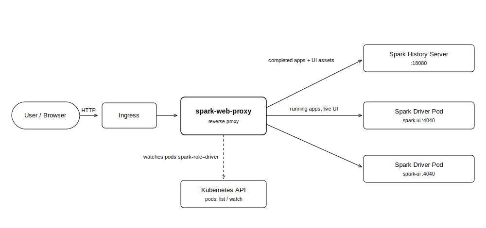

<p align="center">
  <a href="https://okdp.io">
    
  </a>
</p>

[](https://github.com/OKDP/spark-web-proxy/actions/workflows/ci.yml)
[](https://github.com/OKDP/spark-web-proxy/actions/workflows/release-please.yml)
[](https://github.com/OKDP/spark-web-proxy/releases/latest)
[](https://spark.apache.org/)
[](http://www.apache.org/licenses/LICENSE-2.0)

# OKDP Spark Web Proxy

> A reverse proxy that brings **running** Spark applications into the Spark History Server UI on Kubernetes. Live and completed applications appear side by side, with no waiting for event logs, for data teams running Spark on Kubernetes who want a single place to monitor every application.

<p align="center">
  
</p>

---

## What does this project provide?

### Why this project?

The [Spark History Server](https://spark.apache.org/docs/latest/monitoring.html) renders *completed* applications. It can also list *incomplete* (running) ones, but only once their event logs become readable, and on object storage that introduces a real delay: an in-progress event log file stays empty until the application finishes or a rolling threshold (minimum 10&nbsp;MB) is reached. Short or recent jobs are therefore invisible while they run, and their live Spark UIs are unreachable through the History Server.

Within OKDP, Spark is the compute engine and jobs run as pods on Kubernetes; users observe them through the Spark History Server shipped by OKDP. Spark Web Proxy is the monitoring entry point that unifies running and completed applications in that same UI: it discovers running drivers from the Kubernetes API, merges them into the History Server view in real time, and proxies each running application to its live Spark UI. It stays authentication-agnostic, so it composes with the OKDP Spark Auth Filter (OIDC/OAuth2) or any other auth layer.

### Delivered artifacts

- **Docker image** `quay.io/okdp/spark-web-proxy`: the Go reverse proxy that fronts the Spark History Server, discovers running drivers (cluster, client and notebook modes) and proxies their live Spark UIs.
- **Helm chart** `oci://quay.io/okdp/charts/spark-web-proxy`: deploys the proxy on Kubernetes with its Service, RBAC (pod discovery) and optional Ingress.

---

## Architecture

<p align="center">
  
</p>

**Components in the topology:**

- **User / Browser**: reaches Spark monitoring through a single ingress pointing at the proxy (not at the History Server directly).
- **spark-web-proxy**: serves completed applications and static assets from the History Server, and for running applications proxies to the live driver UI. When an application completes, it stops routing to the (now gone) driver and falls back to the History Server.
- **Spark History Server**: the upstream server for completed applications and UI assets, reached over its Kubernetes Service (`http`, port `18080` by default).
- **Spark driver pods**: each running driver exposes a Spark UI on port `4040`. The proxy discovers them via a Kubernetes informer watching pods labelled `spark-role=driver` in the configured namespaces.
- **Kubernetes API**: source of truth for running drivers; the proxy needs `pods` `list`/`watch` permission in the watched namespaces.

---

## Requirements

- Kubernetes cluster (>= 1.19)
- [Helm](https://helm.sh/) >= 3
- A running Spark History Server reachable from the cluster (e.g. the OKDP [spark-history-server](https://github.com/OKDP/spark-history-server) chart), reading event logs from a shared, writable location
- Spark 3.x or 4.x jobs configured to write event logs to that same location
- Access to the `quay.io/okdp` registry (public, no authentication required)

Known-good baseline: chart `0.1.0` with image `0.2.1`, Helm 3 and Kubernetes `1.30`. This is the version set validated in testing.

> The chart's default `image.tag` (`0.1.0`) predates running-applications support. Use `image.tag=0.2.1` (or later) to get the behaviour described here.

### Toolchain tested

| Tool | Version |
|------|---------|
| Kubernetes (Kind) | `1.30.0` |
| Kind | `0.23.0` |
| Helm CLI | `3.18.4` |
| kubectl | `1.33.2` |
| Docker | `28.2.2` |
| Spark | `3.5.1` |

---

## Quick Start

Install the proxy against an existing Spark History Server Service, watching the namespaces where Spark drivers run:

```sh
helm upgrade --install spark-web-proxy oci://quay.io/okdp/charts/spark-web-proxy \
  --version 0.1.0 \
  --namespace spark --create-namespace \
  --set image.tag=0.2.1 \
  --set configuration.spark.history.service=spark-history-server \
  --set "configuration.spark.jobNamespaces={spark}"
```

**Expected result:**

```
NAME: spark-web-proxy
LAST DEPLOYED: <timestamp>
NAMESPACE: spark
STATUS: deployed
REVISION: 1
```

> Replace `0.1.0` with the latest chart version from [Releases](https://github.com/OKDP/spark-web-proxy/releases). Access Spark monitoring through the **Spark Web Proxy** ingress/Service, not the Spark History Server one.

---

## Installation

### Step 1: Deploy a Spark History Server

If you do not already have one, install the OKDP Spark History Server (this creates the `spark-history-server` Service the proxy points at):

```sh
helm install spark-history-server oci://quay.io/okdp/charts/spark-history-server \
  --namespace spark --create-namespace
```

**Expected result:**
```
NAME: spark-history-server
NAMESPACE: spark
STATUS: deployed
REVISION: 1
```

### Step 2: Deploy the proxy

Create a `values.yaml` pointing at the History Server Service and listing the namespaces where Spark drivers run:

```sh
cat > values.yaml <<'EOF'
image:
  tag: "0.2.1"
configuration:
  spark:
    history:
      scheme: http
      service: spark-history-server
      port: 18080
    jobNamespaces:
      - spark
EOF

helm install spark-web-proxy oci://quay.io/okdp/charts/spark-web-proxy \
  --version 0.1.0 --namespace spark -f values.yaml
```

**Expected result:**
```
NAME: spark-web-proxy
NAMESPACE: spark
STATUS: deployed
REVISION: 1
```

### Step 3: Verify and access

```sh
kubectl -n spark get pods
```

**Expected result:**
```
NAME                                    READY   STATUS    RESTARTS   AGE
spark-history-server-...                1/1     Running   0          2m
spark-web-proxy-...                     1/1     Running   0          1m
```

Then port-forward the proxy and open it in a browser:

```sh
kubectl -n spark port-forward svc/spark-web-proxy 4040:4040
# Visit http://localhost:4040
```

The proxy can also run as a sidecar next to the History Server container; in that case set `configuration.spark.history.service=localhost`.

### Cleanup

Remove the Helm releases:

```sh
helm uninstall spark-web-proxy -n spark
helm uninstall spark-history-server -n spark
```

If the namespace was created only for this installation, remove it too:

```sh
kubectl delete namespace spark
```

---

## Configuration

| Parameter | Description | Default | Required |
|-----------|-------------|---------|:--------:|
| `image.tag` | Proxy image tag; use `0.2.1`+ for running-applications support | `0.1.0` | Yes |
| `configuration.spark.history.service` | Service name of the Spark History Server (`localhost` in sidecar mode) | _none_ | Yes |
| `configuration.spark.history.scheme` | Scheme used to reach the History Server | `http` | No |
| `configuration.spark.history.port` | History Server port | `18080` | No |
| `configuration.spark.jobNamespaces` | Namespaces watched for running Spark drivers | `["default"]` | No |
| `configuration.spark.ui.proxyBase` | Base path for proxied Spark UIs; set to `/proxy` when jobs run with `spark.ui.reverseProxy=true` | `/sparkui` | No |
| `configuration.proxy.port` | Port the proxy listens on | `4040` | No |
| `rbac.create` | Create the `Role`/`RoleBinding` granting `pods` `list`/`watch` | `true` | No |

> For the full Helm chart values reference, see [helm/spark-web-proxy/README.md](helm/spark-web-proxy/README.md).

### Spark jobs deployment

Both the Spark History Server and the Spark jobs must log events to the **same** shared, writable directory:

```properties
# Spark History Server
spark.history.fs.logDirectory  /path/to/shared/event/logs

# Spark jobs
spark.eventLog.enabled         true
spark.eventLog.dir             /path/to/shared/event/logs
```

**Cluster mode**: no additional configuration is needed: Spark automatically adds the `spark-role: driver` label and the `spark-ui` (`4040`) port to the driver pods, which is exactly what the proxy discovers:

```yaml
apiVersion: v1
kind: Pod
metadata:
  labels:
    ...
    spark-role: driver
spec:
  containers:
  - args:
    - driver
    name: spark-kubernetes-driver
    ports:
    ...
    - containerPort: 4040
      name: spark-ui
      protocol: TCP
```

**Notebooks / client mode**: the proxy resolves the live driver UI from the Spark History REST API, which requires `spark.ui.port` to be present in the application environment. Spark does not render it by default, so set it at submission, for example in a Jupyter notebook:

```python
import socket

def find_available_port(start_port=4041, max_port=4100):
    """Find the next available port starting from start_port."""
    for port in range(start_port, max_port):
        with socket.socket(socket.AF_INET, socket.SOCK_STREAM) as s:
            if s.connect_ex(("localhost", port)) != 0:
                return port
    raise Exception(f"No available ports found in range {start_port}-{max_port}")

conf.set("spark.ui.port", find_available_port())
```

> When jobs run with `spark.ui.reverseProxy=true`, set `configuration.spark.ui.proxyBase=/proxy`.

---

## Components

Artifacts are published to [`quay.io/okdp`](https://quay.io/organization/okdp).

| Component | Reference | Tag format | Example |
|-----------|-----------|-----------|---------|
| Docker image | [`quay.io/okdp/spark-web-proxy`](https://quay.io/repository/okdp/spark-web-proxy) | `<version>` | `quay.io/okdp/spark-web-proxy:0.2.1` |
| Helm chart | [`quay.io/okdp/charts/spark-web-proxy`](https://quay.io/repository/okdp/charts/spark-web-proxy) | `<version>` | `oci://quay.io/okdp/charts/spark-web-proxy:0.1.0` |

> See [Releases](https://github.com/OKDP/spark-web-proxy/releases) for the full changelog and all available tags. Running-applications support requires image `>= 0.2.0`.

---

## OKDP Integration

This component is part of the OKDP Data Platform, a cloud-native, open-source data platform for Kubernetes.

Spark Web Proxy is the monitoring front door for Spark on OKDP. It depends on a running Spark History Server and on read access to the Kubernetes API for driver-pod discovery. It works with the OKDP Spark images, and composes with the OKDP Spark Auth Filter to secure both the History Server and the live Spark UIs behind OIDC/OAuth2.

---

## Alternatives

Spark Web Proxy is a good fit when you want running and completed applications in one Spark History Server UI on Kubernetes. Depending on your needs, other approaches may be enough:

| Alternative | When to consider it |
|---|---|
| Spark built-in reverse proxy (`spark.ui.reverseProxy=true`) | You only need UI routing through a single endpoint and don't require running apps inside the History Server. Spark Web Proxy can run alongside it with `proxyBase=/proxy`. |
| Per-driver Ingress/Service or `kubectl port-forward` | You occasionally need direct access to one running driver's UI on port `4040` and don't need a unified view or automatic discovery. |
| History Server incomplete-applications list alone | No extra component, but running apps only appear after event logs are flushed; the delay this project removes. |

## Contributing & License

Contributions follow the [OKDP contribution guide](https://github.com/OKDP/.github/blob/main/CONTRIBUTING.md). Released under the [Apache License 2.0](LICENSE).

---

**Built 🚀 for the OKDP Community**
<a href="https://okdp.io"></a>
